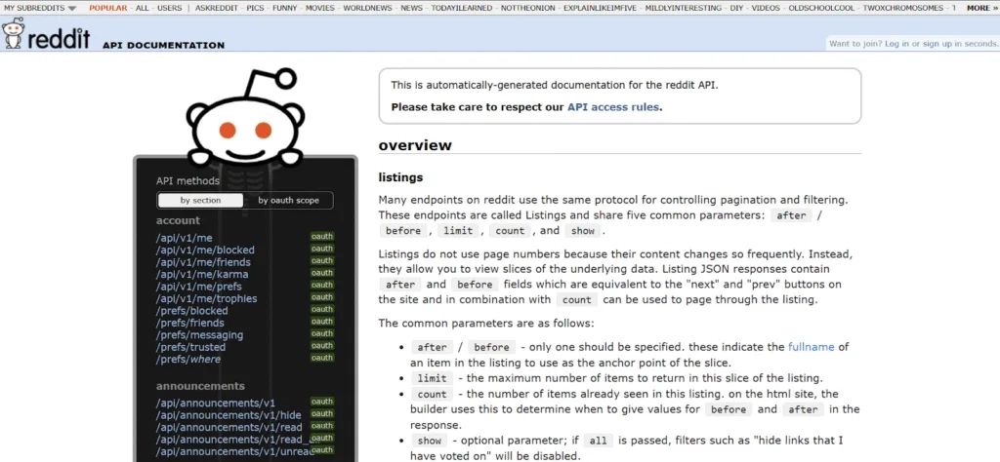
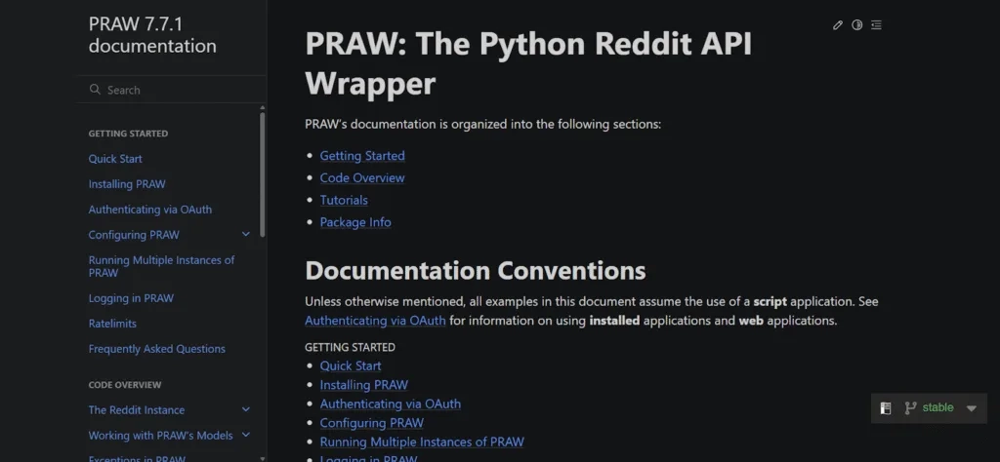
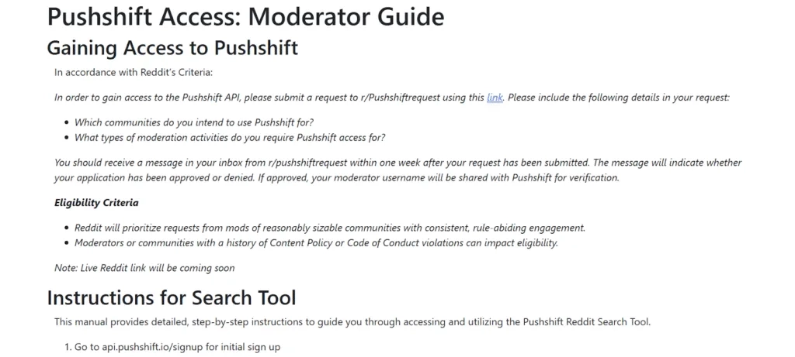
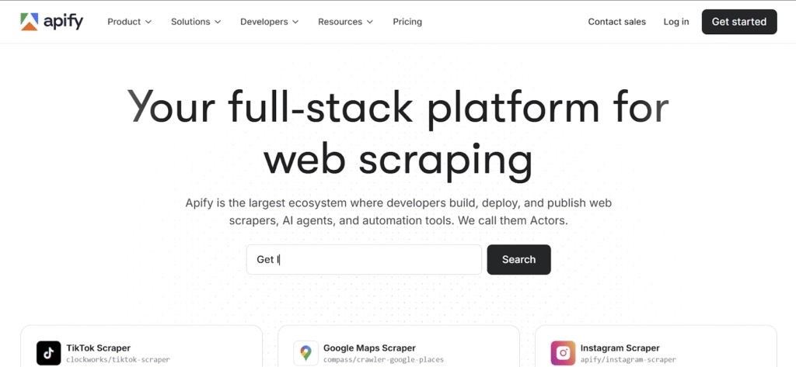
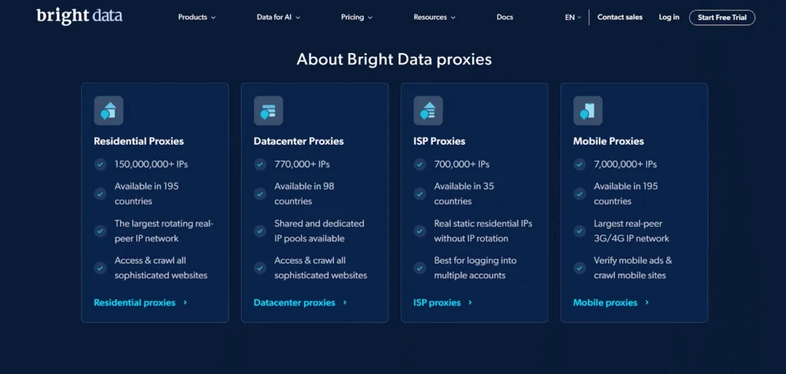
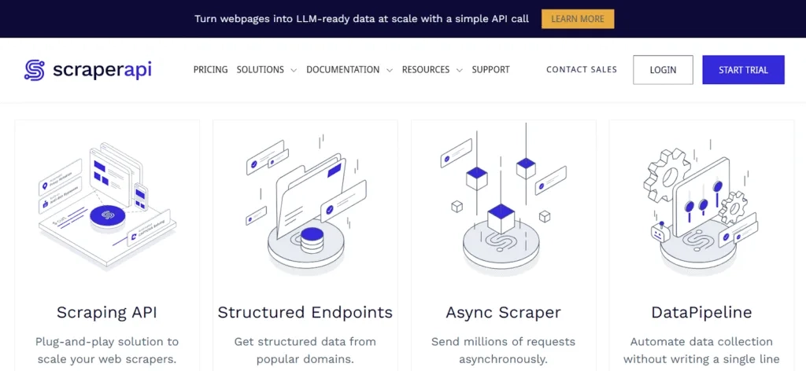
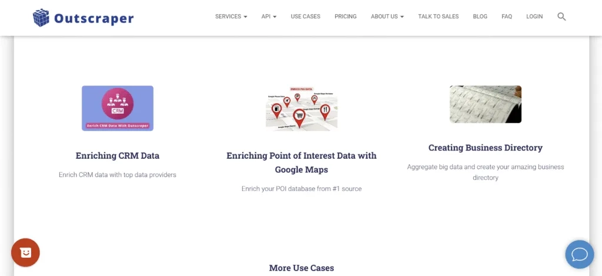
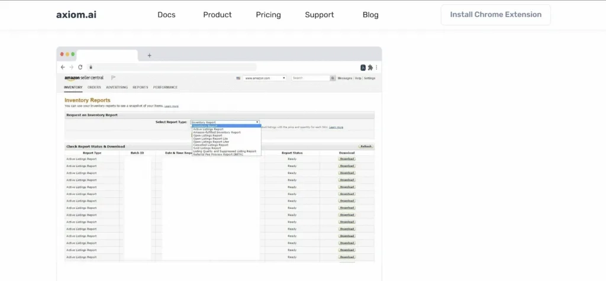
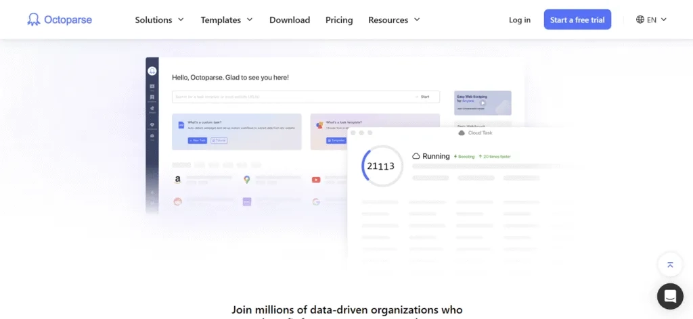
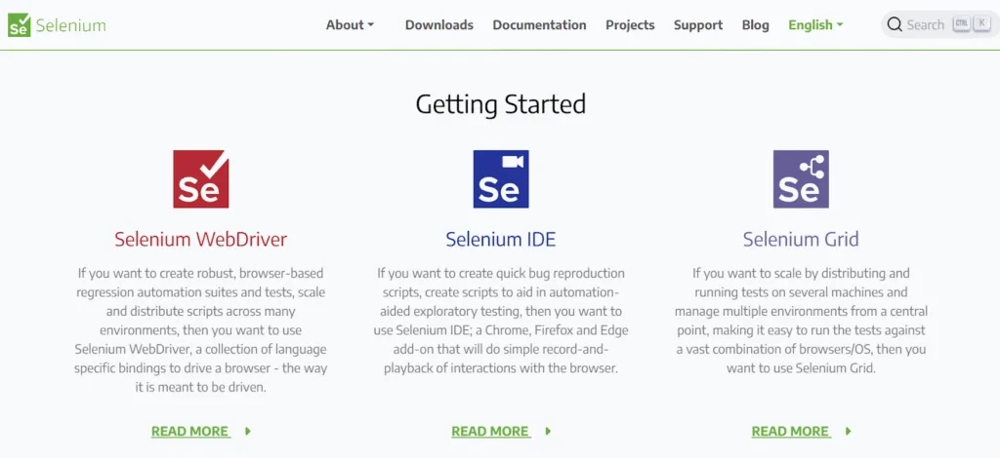

# Best Reddit Scrapers That Actually Work in 2025

Scraping Reddit in 2025? Most tools fail within minutes. Reddit's anti-bot defenses have evolved—constant fingerprint checks, aggressive rate limits, and instant IP blocks are now standard. The old scripts and legacy scrapers simply don't cut it anymore. This guide reviews only the **Reddit scrapers that survive 2025's detection systems**—tools with real proxy rotation, stealth browser modes, JavaScript rendering, and structured data output that professionals rely on for accurate, large-scale extraction without getting blocked.

---

## What Makes a Reddit Scraper Work in 2025

**Stealth and Anti-Detection:** Reddit now fingerprints browsers, throttles requests, and deploys adaptive captchas. A working scraper must rotate proxies, randomize headers, and mimic human behavior—or it gets banned in seconds.

**Structured Data Output:** JSON or CSV export isn't optional. Large-scale analysis demands clean, organized output. Scrapers that dump messy HTML waste your time.

**Comment & Thread Support:** Posts alone tell half the story. Nested comment threads contain the real insights. Scrapers must extract full conversation hierarchies to preserve context.

**Media Extraction:** Images, videos, embedded links—if the scraper can't grab them, you lose critical content. Full media support is mandatory for comprehensive data pulls.

**Scheduler & Automation:** Manual scraping doesn't scale. Automated scheduling and recurring runs are required for continuous monitoring without constant intervention.

---

## Top 10 Reddit Scrapers in 2025

### 1. Reddit API

The official Reddit API provides structured access to posts, comments, subreddits, and user profiles through OAuth 2.0 authentication. It's the most trustworthy source for real-time Reddit data and supports posting, voting, and moderation tasks programmatically. However, strict rate limits and access restrictions make bulk historical extraction challenging.

**Key Features:**
- **Data Retrieval:** Access posts, comments, subreddits, and user profiles in structured format
- **User Interaction:** Submit posts, comments, votes, and messages programmatically
- **Moderation Capabilities:** Manage content approval, removals, and moderation logs
- **OAuth Security:** OAuth 2.0 authentication for secure, controlled API access
- **Rate Limits:** Enforced limits to prevent abuse and maintain system stability

**Pros:**
- Official, well-documented API with continuous updates
- Trustworthy and secure for real-time applications
- Supports full Reddit interaction including posting and moderation

**Cons:**
- Strict rate limits restrict bulk data extraction
- OAuth setup adds complexity for new users
- Certain data restricted to protect privacy and platform integrity

---

### 2. PRAW

PRAW is a Python wrapper around the Reddit API that simplifies Reddit data access for Python developers. It abstracts complex API calls, handles rate limiting automatically, and presents Reddit data as Python objects. PRAW is ideal for scripting, automation, bot development, and data analysis without wrestling with low-level API details.

**Key Features:**
- **Pythonic Interface:** Python classes and methods for posts, comments, users, and subreddits
- **Automatic Rate Management:** Handles Reddit API rate limits and retry strategies internally
- **Comprehensive Object Models:** Maps Reddit entities to Python objects
- **Easy Integration:** Suitable for scripts, bots, or larger data pipelines in Python

**Pros:**
- Significantly reduces development time for Python users
- Supports entire Reddit API with clear, readable code
- Active open-source community and well-maintained documentation

**Cons:**
- Limited by official Reddit API restrictions
- Requires API key and user authentication
- Not suited for non-Python environments

---

### 3. Pushshift API

Pushshift API is a third-party RESTful API providing extensive access to Reddit's historical archives, far surpassing the official API's limitations. It stores billions of Reddit comments and submissions, enabling powerful search, filtering, and aggregation over years of data. Pushshift is essential for researchers and analysts requiring large historical datasets.

**Key Features:**
- **Historical Archives:** Access Reddit data dating back to Reddit's inception
- **Advanced Querying:** Filter by time frames, subreddits, authors, keywords, and more
- **Bulk Data Download:** Download large datasets for research and data mining
- **Elasticsearch Backend:** Efficient full-text search through Elasticsearch service

**Pros:**
- Unmatched access to large-scale historical Reddit data
- Supports complex queries impossible with official API
- Critical for academic research and trend discovery

**Cons:**
- Not officially affiliated with Reddit—potential policy changes
- Some features limited to verified users or moderators
- Occasional service interruptions and uncertain long-term availability

---

### 4. Apify

Apify is a cloud-based scraping platform offering ready-to-use Reddit scrapers through its marketplace. Users without programming skills can scrape posts, comments, profiles, and media with simple setup and scheduling. Apify handles proxy rotation and CAPTCHA solving automatically. It's suited for businesses needing scalable extraction with minimal technical overhead, though scraper quality varies as many are third-party-built.

**Key Features:**
- **No-Code Scraping:** Pre-built Reddit scrapers accessible through web interface
- **Automation and Scheduling:** Set recurring scraping jobs and automated collection
- **Proxy and CAPTCHA Integration:** Built-in solutions for overcoming scraping obstacles
- **Data Export Flexibility:** Supports JSON, CSV, and other formats

**Pros:**
- Ideal for users without coding expertise
- Integrated proxy management and CAPTCHA handling
- Marketplace offers multiple scraper options

**Cons:**
- Dependent on third-party scraper quality and maintenance
- Limited customization compared to custom solutions
- Costs grow with heavy usage and advanced features

---

### 5. Bright Data

Bright Data is an enterprise-grade data collection service with a massive proxy network and advanced anti-bot bypass technologies for large-scale, stealthy Reddit extraction. Its Reddit scraper extracts posts, comments, user activity, and full threads while avoiding Reddit's anti-scraping defenses. With over 770,000 IPs across nearly 100 countries, sophisticated dashboard control, API access, and 24/7 support, Bright Data is the top choice for complex, high-volume Reddit scraping requiring reliability and compliance.

👉 [Extract Reddit data at scale without getting blocked—Bright Data handles the hardest scraping challenges](https://www.scraperapi.com/?fp_ref=coupons)

**Key Features:**
- **Extensive Proxy Network:** Over 770,000 IPs across nearly 100 countries
- **Anti-Bot Evasion Techniques:** Bypass Reddit's captchas, rate limits, and fingerprinting
- **Comprehensive Data Extraction:** Captures posts, comments, user karma, and nested discussions
- **Advanced Control & Automation:** Real-time monitoring, customizable workflows, API access
- **Responsive Support:** 24/7 enterprise-level customer service

**Pros:**
- Superior reliability for mission-critical scraping needs
- Scalable infrastructure for large datasets and complex workflows
- Strong proxy rotation and anti-detection minimize failures

**Cons:**
- Premium pricing less accessible for small users or low-budget projects
- Platform complexity requires technical familiarity
- Bandwidth and usage caps restrict extremely large operations without additional cost

---

### 6. Scraper API

Scraper API is a powerful web scraping tool that handles proxies, browsers, and CAPTCHA automatically, simplifying extraction from complex sites like Reddit. It abstracts proxy management and request handling so developers focus solely on data extraction. Scraper API supports JavaScript rendering and retries failed requests, making it ideal for scraping dynamic content and avoiding blocks during high-volume extraction.

**Key Features:**
- **Proxy & IP Rotation:** Automatically rotates IPs from vast proxy pool to prevent detection
- **JavaScript Rendering:** Accesses content requiring JavaScript execution
- **Automatic Captcha Handling:** Solves Captchas without manual intervention
- **Highly Scalable API:** Handles large volumes with built-in retries and error handling

**Pros:**
- Minimal setup with fully managed proxy and CAPTCHA services
- Supports complex, dynamic pages needing JavaScript execution
- Scale-friendly with consistent performance for large data needs

**Cons:**
- Costs rise significantly with heavy usage
- Less customizable for users wanting fine control over scraping logic
- No built-in UI—primarily developer-focused API service

---

### 7. Outscraper

Outscraper is a cloud-powered scraping service focused on simplicity and ease of use. It offers ready-to-use APIs for extracting Reddit data with minimal configuration. Outscraper handles proxies, CAPTCHA solving, and data parsing, delivering clean data for analytics, market research, and competitive intelligence.

**Key Features:**
- **One-Click APIs:** Quick access for fetching Reddit posts, comments, and profiles
- **Automatic Proxy Management:** Ensures anonymity and bypasses scraping restrictions
- **CAPTCHA & Bot Detection Handling:** Integrated mechanisms to reduce blocking risks
- **Flexible Data Formats:** Outputs in JSON, CSV, or Excel formats

**Pros:**
- User-friendly interface and minimal setup requirements
- No need to manage proxies or CAPTCHA manually
- Useful for smaller projects and fast data retrieval

**Cons:**
- Limited customization options for advanced users
- API quotas may limit heavy or extended scraping
- Dependence on service availability and updates

---

### 8. Axiom.ai

Axiom.ai is a no-code web automation and scraping platform designed for business users and non-developers. It enables building custom scraping workflows through an intuitive visual editor without programming. Axiom supports scheduling, data export, multi-step workflows, and proxy management, making Reddit data extraction accessible without code.

**Key Features:**
- **Visual Workflow Builder:** Drag-and-drop interface to create scraping pipelines
- **Scheduled Runs:** Automate scraping tasks on set timetable or trigger-based
- **Proxy Integration:** Built-in support for proxies to avoid detection
- **Multi-Format Export:** Export scraped data in CSV, Excel, or JSON formats

**Pros:**
- No coding skills required—accessible to business users
- Flexible for various scraping and automation scenarios
- Supports recurring data collection with scheduling

**Cons:**
- May struggle with very complex scraping logic
- Subscription pricing varies with usage and potentially costly
- Limited control compared to code-based scrapers

---

### 9. Octoparse

Octoparse is a widely used visual web scraping software designed for both beginners and tech-savvy users. It provides a desktop client and cloud platform to build scraping workflows without coding via point-and-click interface. Octoparse handles anti-bot mechanisms with built-in proxies and offers scheduling, cloud extraction, and multi-format exports, enabling efficient Reddit data extraction at scale.

**Key Features:**
- **Visual Workflow Creation:** Point-and-click to design scraping tasks without coding
- **Cloud and Local Extraction:** Both cloud-based scraping and local extraction options
- **Anti-Bot Bypass:** Incorporates proxy rotation and CAPTCHA solving tools
- **Export Flexibility:** Supports Excel, CSV, HTML, and database exports

**Pros:**
- User-friendly for non-programmers with powerful features for pros
- Supports large-scale data collection with cloud services
- Comprehensive tutorials and community resources

**Cons:**
- Cloud service pricing may be expensive for heavy usage
- Certain advanced scenarios require technical know-how
- Desktop app might be resource-intensive on low-end machines

---

### 10. Selenium

Selenium is an open-source browser automation tool widely used for testing but powerful for web scraping, especially sites with heavy JavaScript or interactive features like Reddit. Unlike traditional scrapers, Selenium controls a real browser instance, enabling navigation of dynamically generated content and simulating user behavior to avoid blocks.

**Key Features:**
- **Full Browser Automation:** Controls Chrome, Firefox, and other browsers for precise interaction
- **JavaScript Execution:** Scrapes content rendered via JavaScript frameworks
- **User Interaction Simulation:** Mimics real users by clicking, scrolling, and form-filling
- **Cross-Platform:** Compatible with multiple OS and programming languages

**Pros:**
- Highly flexible with control over entire browsing session
- Ideal for scraping dynamic, interactive web pages
- Extensive language and platform support

**Cons:**
- Slower than traditional scrapers due to full browser overhead
- Requires programming skills and setup
- Less scalable for very large data extraction due to resource consumption

---

## Why Reddit Data Extraction Matters in 2025

**Access to Real-Time Opinions:** Reddit captures raw user thoughts and reactions on countless topics immediately—no filtered PR speak, just real voices.

**Market & Competitor Insights:** Extracted data reveals trends, customer preferences, and competitor activities for strategic decisions. Reddit discussions expose what users actually think about products and brands.

**Sentiment & Social Analysis:** Reddit data fuels sentiment tracking and social trend monitoring to gauge public mood and emerging issues before they hit mainstream media.

**Source for AI & Research:** The vast text and behavioral data support training AI models and deep community understanding. Reddit's conversational format provides context-rich training data.

**Comprehensive Context:** Posts, comments, and media provide full conversational context for better data-driven conclusions. Single posts tell stories; comment threads reveal the full narrative.

---

## Conclusion

In 2025, scraping Reddit data requires tools adaptive and powerful enough to overcome constant platform updates and strict anti-bot defenses. The scrapers reviewed here excel by offering unique strengths in reliability, ease of use, scale, and security.

Selecting the right Reddit scraper depends on data volume needs, technical capability, and project goals. Smaller-scale projects benefit from intuitive, ready-to-use scrapers, while large-scale extraction demands advanced proxy control and anti-blocking mechanisms. 

👉 [Start scraping Reddit data reliably with tools that actually survive 2025's detection systems](https://www.scraperapi.com/?fp_ref=coupons)

Regardless of choice, continuous monitoring and adaptation remain mandatory to sustain Reddit access as the platform evolves. Use these insights to efficiently capture Reddit data with minimal effort and maximum security.
